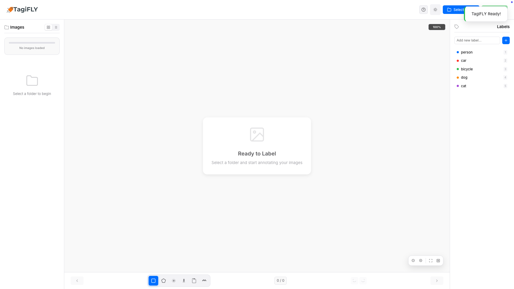
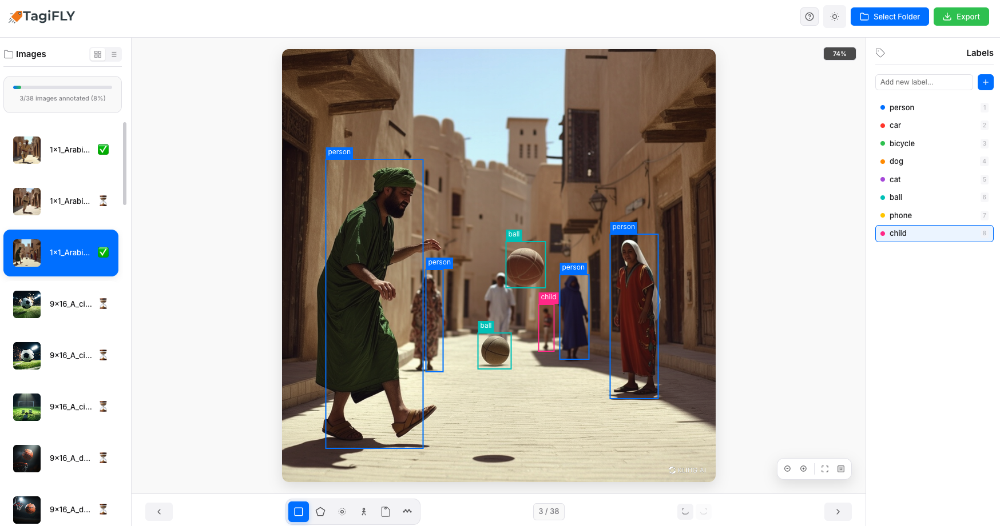
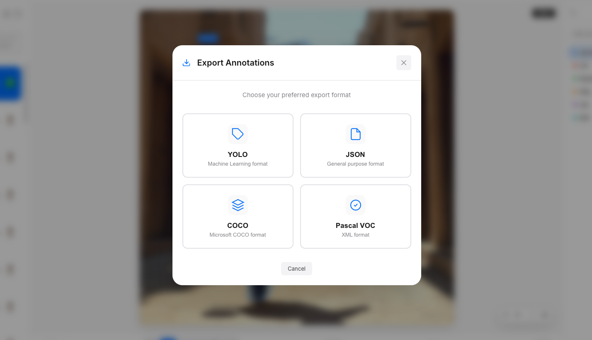
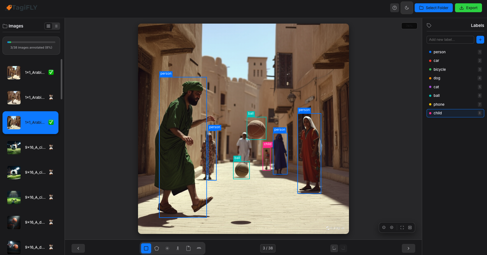
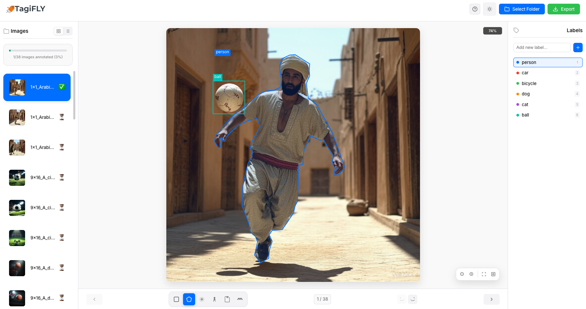

# TagiFLY v1 (Beta) 
# Labelling Tool for AI Computer Vision

Open source, lightweight, and focused only on what you need.

## 📸 Screenshots

| Main Screen | Annotation Example |
|-------------|---------------------|
|  |  |

| Export Window | Dark Mode | Light Mode |
|---------------|-----------|------------|
|  |  |  |


## 🚀 **What is TagiFLY?**

TagiFLY is an open-source **labelling tool for AI computer vision** projects.  
The goal is simple: Mark your images, save them, and use them in your AI/ML projects.  

- 🤖 Training data for machine learning  
- 🎯 Computer vision projects  
- 📊 Research & personal experiments  

## ✨ Features

- 📦 **6 annotation tools**: Box, polygon, point, line, mask, keypoints  
- 📤 **4 export formats**: JSON, YOLO, COCO, Pascal VOC  
- 🎨 Light / dark theme  
- ⌨️ Keyboard shortcuts for faster workflow  
- 🖼️ Supports JPG, PNG, BMP, GIF, WebP  

## 📤 Export Options

- **JSON** → Full project backup  
- **YOLO** → For object detection models  
- **COCO** → Research standard format  
- **Pascal VOC** → XML-based compatibility  

## ⚠️ Note (Beta Release)

This is the **first release (Beta)**.  
It may contain bugs or missing features. Please share your feedback so we can improve it together. 🚀  

### **Quick Start**

```bash
# Clone the repository
git clone https://github.com/dvtlab/tagiFLY.git

# Navigate to project directory
cd tagiFLY

# Install dependencies
npm install

# Start the application
npm start
```
## 🎮 Usage

- Select an image folder  
- Pick a tool and start annotating  
- Export your work in JSON / YOLO / COCO / VOC format  

## 📄 License

This project is licensed under the **MIT License** - see the [LICENSE](LICENSE) file for details.

**Open Source & Free** - Use it anywhere, modify it, contribute to it! 🚀  

---

<div align="center">

⭐ If TagiFLY helps you, don’t forget to leave a star!  

Made with 💙 by dvtlab  

📧 Contact: dvtlab@outlook.com  

</div>
